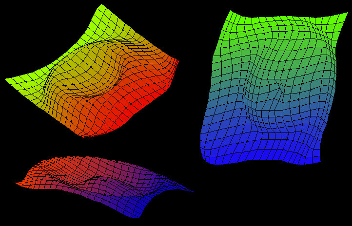



## True 3D Plane with Rippling Effect, Flat Shaded, Cycling Colors\.\.\. Lots of Fun\.

### Description

I made this one day when I was bored. It started out as a 3d graphics editor thing, but now it is what you see. For those of you who want to try it, you can easily texture each polygon to make it a rippling bitmap... also lots of fun.
 
### More Info
 

             |
---                |---
**Submitted On**   |2000-06-24 14:49:00
**By**             |[Rom](https://github.com/Planet-Source-Code/PSCIndex/blob/master/ByAuthor/rom.md)
**Level**          |Intermediate
**User Rating**    |5.0 (10 globes from 2 users)
**Compatibility**  |VB 5\.0, VB 6\.0
**Category**       |[Miscellaneous](https://github.com/Planet-Source-Code/PSCIndex/blob/master/ByCategory/miscellaneous__1-1.md)
**World**          |[Visual Basic](https://github.com/Planet-Source-Code/PSCIndex/blob/master/ByWorld/visual-basic.md)
**Archive File**   |[CODE\_UPLOAD71056242000\.zip](https://github.com/Planet-Source-Code/rom-true-3d-plane-with-rippling-effect-flat-shaded-cycling-colors-lots-of-fun__1-9227/archive/master.zip)

